# Kickoff Knowledge Quiz

Welcome to the Soccer Knowledge Quiz project! This quiz is designed to challenge and enhance your understanding of the world's most popular sport, soccer. Whether you're a passionate fan, a budding player, or just someone looking to test your knowledge, this quiz offers a fun and educational experience. Dive into questions covering the history of soccer, famous players, iconic matches, rules of the game, and much more. Get ready to put your soccer knowledge to the test and see how you score!

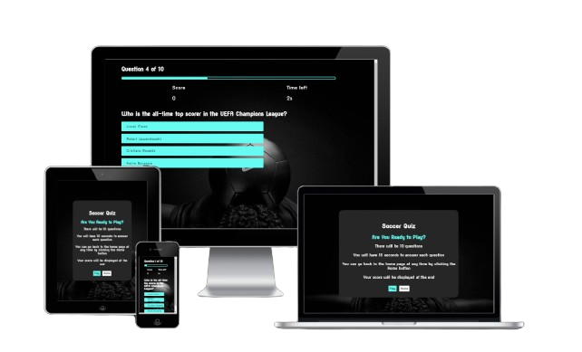

## Why 

Why did I choose this topic? Soccer as a sport is very close to me. It has truly helped me through tougher times in life as an escape, and I believe many people can resonate with that. I watch, and play, as much as I can today and it's often the high point of my day. It's the beautiful game.

## Table of Contents

- [Creation Structure](#creation-structure)
- [User Experience](#user-experience)
- [Goals](#goals)
- [Features](#features)
- [Design](#design)
- [Future Deployment](#future-deployment)
- [Testing](#testing)
- [Bugs](#bugs)
- [Deployment](#deployment)
- [Credits](#credits)

## Creation Structure
### Wireframes
- Difficulty

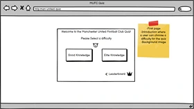 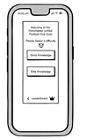

I decided not to go with a difficulty option in this quiz, instead focusing on increasing and improving functionality and features on one general level. 

- Questions 

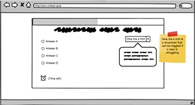 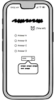

- Results

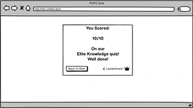

Due to having no backend and having to use local storage, which is limited in its abilities, I did not implement the leaderboard feature.

## User Experience

Users who come to this web app will be greeted with a sleek homepage, with a nice color pallette, featuring a light blue color on buttons and some text and a dark black background image. This hopes to promote a positive and memorable user experience.

### First Time Users

First time users want to:
- Understand what the site is
- Easily access the quiz
- Be informed of the rules
- Track their score

### Repeat Users

Users who wish to use the site more than once can do so, hoping to improve on their score with each subsequent attempt. A good foundation has been built and can be used as a springboard to make this app much larger scale. In the future, more quiz options will be added, with varying difficulties and more niche quizzes such as specific tournaments and teams.

## Goals

The goal of this web app is to test the users knowledge of the sport, and also educate while allowing users to enjoy the experience and feel rewarded afterwards, either for good knowledge of the sport, or learning and increasing their expertise.

## Features

The site was made using mobile first design, meaning it is fully responsive on screens tested up to 2560px.

This web app offers some sleek and well designed features. Some of these took inspiration from a youtube tutorial documented in the credits section, but all code written is original and others have been added from scratch.

Some of these features include :
- A Landing page container with link styled as a button

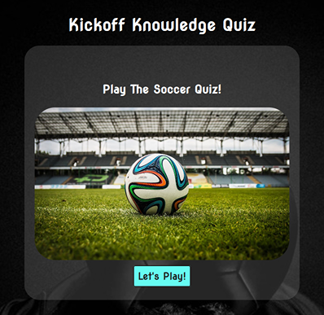

- The Rules screen, outlining the timer, score and, once again, with links styled as buttons

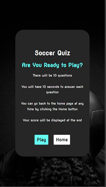

- The Question counter. This increments through each question (one to ten), and displays the current question to the user

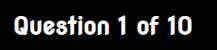

- A score counter, to keep track of the users score, incrementing by 1,000 for each correct question

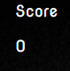

- Timer, decrementing by one every second and moving to the next question if it hits zero

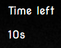

- Questions and choices, changing each time a user answers or the timer hitz zero, and giving feedback whether the answer was correct or incorrect 

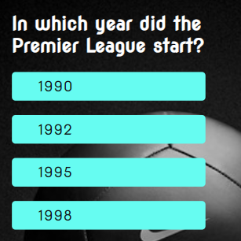

- The chosen answer will be highlighted in red if incorrect or green if correct. The user will be given time after answering to see the result and understand whether their answer was right or wrong.

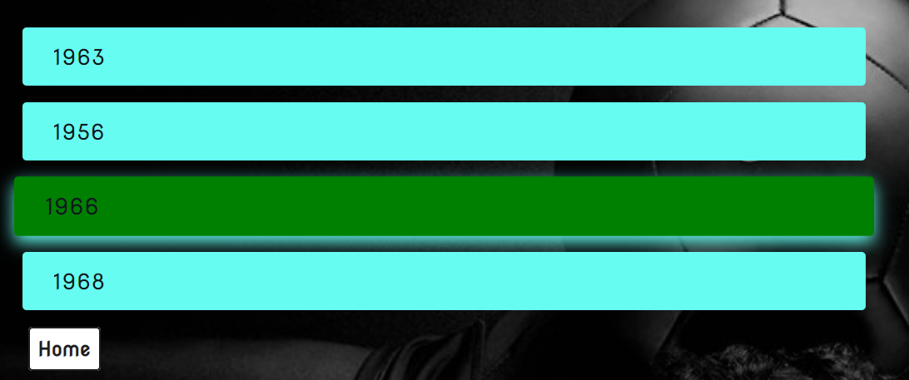

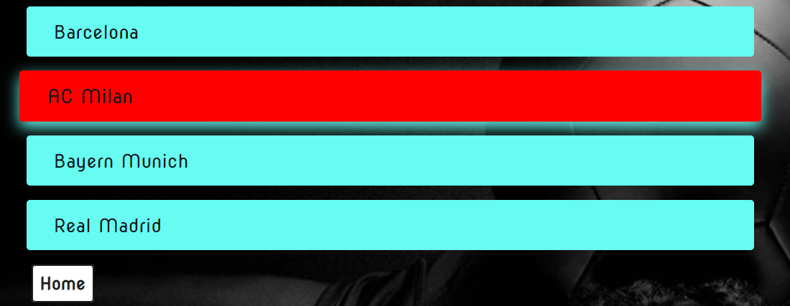

- Final score. The final score is shown to the user on the end page to let them know how they've done

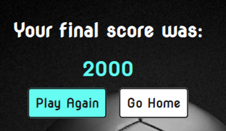

## Design

The design for Kickoff Knowledge features a dark black background image, and light blue added genrously to give a modern, almost futuristic feel to the quiz. The design hopes to capture a user, and allow them to get lost in the game for the period they spend playing it.

## Future Deployment

As stated in the [Repeat Users](#repeat-users) section, there are many plans for future deployment. This web app can be used as a foundation to create a plethera of different quizzes relating to the beautiful game of soccer. Some of these include:
- More Questions for the quiz
- More difficulties
- Niche quizzes for specific teams or tournaments
- A leaderboard with backend support
- An option to create your own quiz
- After all this is implemented, adding more games to make the site as accessible as possible to everybody

## Testing 
[Testing](/TESTING.MD)

## Credits
### General Credits

- [Youtube tutorial](https://www.youtube.com/watch?v=f4fB9Xg2JEY&list=PLmEz6BxNwVPc-oP7rMw_oJ7yssN0jT844&index=2) By 'Brian Design'.

This was used as a baseline to help get a grasp on javascript, but the code written is my own and this tutorial only provided inspiration and a guide of where to go. 

- [ChatGPT](https://chatgpt.com/) used for getting the questions for the quiz.
- [Red Ketchup](https://redketchup.io/) used to compress and resize images.
- [Remove bg](https://www.remove.bg/) used to remove backgrounds of images used in the README.
- Mentor, David Bowers.
- Course cohort, Marko Tot.

### Photos 

- [Sports quiz photo](https://www.pexels.com/photo/multicolored-soccer-ball-on-green-field-47730/)
- [Background](https://mrwallpaper.com/images/hd/hd-football-nike-black-hhdfdw95z8vh702t.jpg)