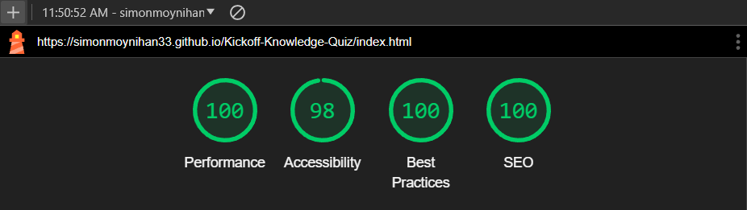
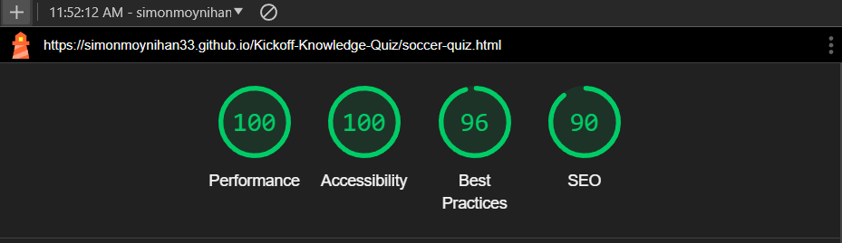
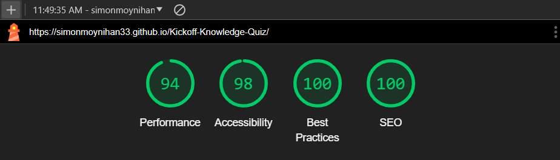
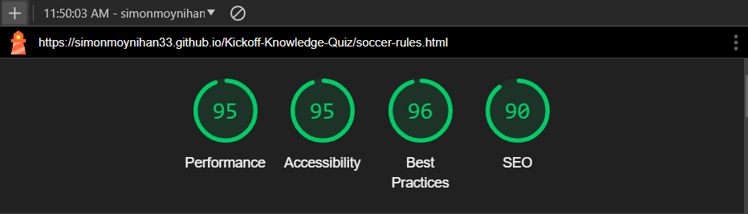
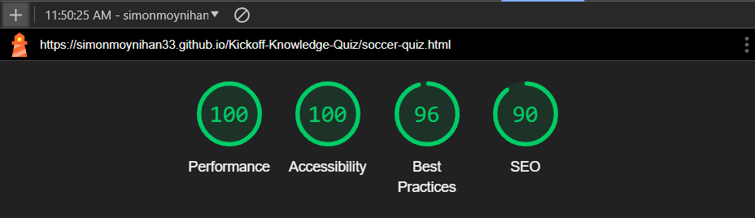
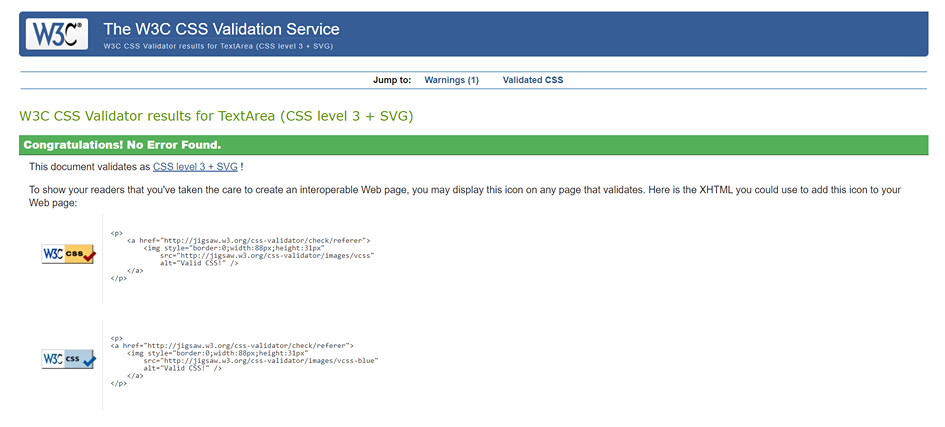
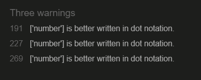
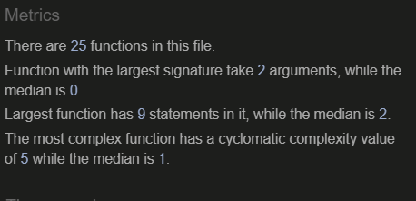

### Commits
I had a massive issue with getting the end page to display on the live site, and then getting the score to implement. This was not an issue on the local site, which is why many of my commits are pushing to test solutions on the live site. I understand this is not ideal but it was the only way to test the live site end page worked as intended

### Manual Testing
Manual testing was carried out on multiple screen sizes and web browsers

**Screen sizes**
- No issues were found when testing on mobile, tablets, laptops and desktops. All media queries acted as intended and the app worked smoothly.

**Browsers**
- FireFox

No issues found when using Firefox web browser

- Yahoo

No issues found when using Yahoo search engine

- DuckDuckGo

No issues were found when using DuckDuckGo

- Microsoft Bing

No issues were found when using Microsoft Bing

- Safari on mobile

No issues were found when using Safari on mobile

### External Testing

The live site was sent out to family and friends to use and report back any issues. Any issues reported back were fixed, such as font sizes and white space below home page. These were all fixed.

### Lighthouse scores
#### Desktop
- Index page



- Rules page


- Quiz page



#### Mobile
- Index page



- Rules page



- Quiz page



### Validator Testing 

- HTML
  **Index page** No errors were returned when passing through the official [W3C validator](https://validator.w3.org/nu/?doc=https%3A%2F%2Fsimonmoynihan33.github.io%2FKickoff-Knowledge-Quiz%2Findex.html)
  
  **Rules page** No errors were returned when passing through the official [W3C validator](https://validator.w3.org/nu/?doc=https%3A%2F%2Fsimonmoynihan33.github.io%2FKickoff-Knowledge-Quiz%2Fsoccer-rules.html)

  **Quiz page** No errors were returned when passing through the official [W3C validator](https://validator.w3.org/nu/?doc=https%3A%2F%2Fsimonmoynihan33.github.io%2FKickoff-Knowledge-Quiz%2Fsoccer-quiz.html)

  **End page** No errors were returned when passing through the official [W3C validator](https://validator.w3.org/nu/?doc=https%3A%2F%2Fsimonmoynihan33.github.io%2FKickoff-Knowledge-Quiz%2Fend.html)

- CSS

No errors were found when passing through the official Jigsaw validator via direct input


  

- JS 
No errors were found when passing through the official [JSHint validator](https://jshint.com/).

Three warnings were recieved, but after a google search I found these are not major issues and, the code all works as intended.



The metrics of Kickoff Knowledge Quiz were:




- WAVE
  - Each page was put through [WAVE](https://wave.webaim.org/) evaluation tool and any errors found were fixed.

## Bugs
#### Bug 1 

Issue - Cannot get the options in the containers to show along with question.

- Troubleshooting -

I knew this had something to do with the ```function updateQuestion()```, as this was responsible for handling the updating of the question and choices and removing the old ones. I used  ```console.log()``` in the choices section of my function and the console threw the error ```Uncaught ReferenceError: number is not defined```.

This led me to the conclusion it was due to my naming of a variable and it not being properly defined.

- Fix - ```const choiceNumber = choice.dataset['number];``` needed to be changed to ```const number = choice.dataset['number'];```

#### Bug 2 

Issue - Page must be refreshed in order to pick a new answer.

Cause - Misspelling of function. 

Fix -The function was not being called due to a spelling error ```function enableAnsweringAnswering ()``` after I had changed it from ```allowAnswering()```.

#### Bug 3

Issue - Progress bar not updating with questions.

- Troubleshooting -

I was unable to see the issue here myself. I spent a long time looking through the code but as I had not come across this specific code before I was unable to see the issue. To trouble shoot this the only option I felt I had was to look through outside resources, I asked a question about it on a thread on stack overflow and got a reply telling me where my issue was. 

- Fix - Change ```progressBarFull.computedStyleMap.width = `${(questionCounter/MAX_QUESTIONS) * 100}%``` to ```progressBarFull.style.width = `${(questionCounter/MAX_QUESTIONS) * 100}%```

#### Bug 4 

Issue - Timer not counting down.

- Troubleshooting -

I searched through my code implementing the timer thouroughly. Here, I turned to perplexity AI, and asked it why a timer would not be counting down. They gave me many reasons and things to check, one of which was that I had properly declared the variable in my global scope. After checking, I saw my issue was a syntax mistake in the variable ```const timerText = document.querySelector('timerText');```.

- Fix - Change variable to ```const timerText = document.querySelector('#timer-text');```

#### Bug 5

Issue - Timer does not reset after moving to next question.

Cause - resetTimer(); was not being called when needed.

Fix -  Add ```resetTimer();``` function to ```getNewQuestion();``` function

#### Bug 6

Issue - Timer increments by two seconds instead of one.

Troubleshooting: 

This bug was hugely time consuming. To trouble shoot I added multiple ```setTimeout``` in different places to make the timer increment slower, but this only made the timer of the first question take longer than 10s to reach 0, and once a question was answered the timer would decrement by 2 again. My thinking was that the ```decrementTimer();``` function calls itself twice per second within it's own function, but when this was removed it would only decrement once and not continue. 

I firstly put a second ```setTimeout``` within the function: 
```
 // Wrapped in seperate setTimeout so the timer does not decrement by two seconds
        setTimeout(() => {
            decrementTimer(); // Repeat call to continue the countdown
          }, 1000);
```
This did not work and only served to slow down the first iteration of the countdown to two seconds per one second countdown.

Secondly, I reached out to tutor support. Gemma and I spent about 30-40 minutes troubleshooting the issue together to no avail. Every possible solution led to the same result or the timer refusing to decrement at all. 

Next, I removed the ```decrementTimer();``` function within itself and called it within the ```updateTimer();``` function instead. This is cleaner as the function was not calling itself from inside itself, but did not solve the issue. I also added multiple console.log's throughout the ```decrementTimer();```, ```updateTimer();``` and ```resetTimer();``` respectively, showing that it was indeed decrementing by one second, but that was happening twice *per second*.

Cause - The problem was that every time decrementTimer is called, a new timeout was set without clearing the previous one. This caused multiple timeouts to run concurrently, speeding up the timer.

Fix - Use ```setInterval``` instead of ```setTimeout``` and clear interval whenever timer is reset, in the ```handleTimeExpired()``` function.

#### Bug 7

Issue - File path not working in JS. When the quiz is finished the end.html page won't show on live site.

Cause - / before the file was causing this issue

Fix - Change to ```window.location.replace('end.html')'```

#### Bug 8

Issue - Could not get score to show on end.html

This issue forced me to push a huge amount of commits as it was only occuring on the live site and pushing was the only way to test changes.

Troubleshooting - I used absolute and relative file paths, none of which worked. I also tried using the full http which also did not work. This was a huge issue that forced me to run through my code and add if statements to most of my functions that did not already have them in the hopes of finding a solution. 

Cause - 

```
const mostRecentScore = localStorage.getItem('mostRecentScore');
    if (finalScore) {
        finalScore.innerText = Number(mostRecentScore);
    }
```

Fix - Change to 

```
const lastScore = localStorage.getItem('mostRecentScore');
    if (finalScore) {
        finalScore.innerText = Number(lastScore);
    }
```

#### Bug 9 

Issue - White space at the bottom of screen on home page

Cause - Added img element in html to have an alt tag but never set the display to hidden

Fix - Add ```class="hidden"``` to img tag and ```display: none;``` to hidden class in css

#### Bug 10

Issue - Hint button not working

Troubleshooting - I found it would only apply when ```!important``` was used in the hidden class, leading me to realise the issue was due to specificity

Cause - CSS specificity

Fix - Add new CSS code ```.choice-container .hidden {display: none;}``` to increase specificity and apply hidden class


## Unfixed Bugs

There are no bugs I have left unfixed.

[**Back to Readme**](/README.md#testing)
